# Informe Final - CircleGuard: Sistema de Trazabilidad de Contactos

Enlace al video: https://drive.google.com/drive/folders/1BZKApGHqL5nyCX9m3YgLcVjoE5s1mb4A?usp=sharing

Enlace repo 1: https://github.com/DanielJPC19/circle-guard-public-development

Enlace repo 2: https://github.com/DanielJPC19/circle-guard-public-production

## Resumen Ejecutivo

CircleGuard es un sistema universitario de trazabilidad de contactos y monitoreo de salud desarrollado como parte del proyecto de ingeniería de software. El sistema implementa una arquitectura de microservicios con pipeline de CI/CD automatizado mediante Jenkins, desplegando en Google Kubernetes Engine (GKE).

Este documento consolida todos los componentes implementados, las configuraciones realizadas, las pruebas ejecutadas y las variaciones respecto a los planes originales.

---

## 1. Arquitectura del Sistema

### 1.1 Componentes de Microservicios

El sistema está compuesto por 6 microservicios Spring Boot 3.2.4 con Java 21 y Kotlin:

| Servicio | Puerto | Rol | Tecnología |
|----------|--------|-----|------------|
| `circleguard-auth-service` | 8180 | Autenticación JWT + LDAP | Spring Security, LDAP |
| `circleguard-identity-service` | 8083 | Anonimización de identidades (FERPA) | Criptografía hashing |
| `circleguard-promotion-service` | 8088 | Motor de grafo de contactos Neo4j | Neo4j, Apache Kafka |
| `circleguard-gateway-service` | 8087 | Validación QR campus | Redis, Spring Security |
| `circleguard-notification-service` | — | Despacho notificaciones | Kafka Consumer, Twilio |
| `circleguard-form-service` | 8086 | Formularios de salud | Spring Data JPA |

### 1.2 Arquitectura Multi-Repositorio

```
┌─────────────────────────────────────────────────────────────┐
│  REPO DESARROLLO (circle-guard-public-development)         │
│  Rama: develop → release/* → master                        │
│  Jenkins Multibranch Pipeline                               │
├─────────────────────────────────────────────────────────────┤
│  Rama develop:                                              │
│    • Build Gradle (sin tests)                               │
│    • Unit Tests                                            │
│    • Docker Push :dev                                       │
│    • Trigger OPS (HTTP POST) → deploy dev                 │
│                                                             │
│  Rama release/*:                                            │
│    • Build Gradle                                          │
│    • Unit Tests                                            │
│    • Integration Tests                                     │
│    • Docker Push :staging                                  │
│    • Trigger OPS → deploy stage                             │
│    • E2E Tests contra stage                                │
│                                                             │
│  Rama master:                                              │
│    • Build Gradle                                          │
│    • Unit Tests                                            │
│    • Integration Tests                                     │
│    • Docker Push :latest + :vN + :SHA                      │
│    • Performance Tests (Locust)                             │
│    • Release Notes                                          │
│    • Aprobación Manual                                     │
│    • Trigger OPS → deploy prod                              │
│    • Git Tag vN                                            │
└─────────────────────────────────────────────────────────────┘
                              │
                              │ HTTP POST (trigger)
                              ▼
┌─────────────────────────────────────────────────────────────┐
│  REPO OPERACIONES (circle-guard-public-production)         │
│  Jenkins Pipeline: circleguard-cd-infra                     │
│  Parámetros: IMAGE_TAG, ENVIRONMENT                        │
├─────────────────────────────────────────────────────────────┤
│  Stages del Pipeline OPS:                                  │
│    1. GCloud Auth & Kubectl Config                         │
│    2. Validate Manifests (dry-run)                         │
│    3. Update Image Tags                                    │
│    4. Apply Secrets                                        │
│    5. Deploy (kubectl apply)                               │
│    6. Rollout Verification + Auto-rollback                 │
│    7. Health Check                                         │
│    8. Deployment Summary                                   │
└─────────────────────────────────────────────────────────────┘
                              │
                              ▼
              ┌───────────────────────────────┐
              │     GKE Cluster               │
              │  namespaces: dev/stage/prod   │
              └───────────────────────────────┘
```

---

## 2. Repositorio de Desarrollo

### 2.1 Dockerfiles Multi-Stage

**Objetivo**: Crear imágenes Docker optimizadas para producción de los 6 servicios.

**Implementación**: Cada servicio tiene un Dockerfile en `services/circleguard-[servicio]/Dockerfile` con el patrón:

```dockerfile
# Stage 1: Builder
FROM eclipse-temurin:21-jdk-alpine AS builder
WORKDIR /app
COPY gradlew settings.gradle.kts build.gradle.kts ./
COPY gradle/ gradle/
COPY services/circleguard-[servicio]/build.gradle.kts services/circleguard-[servicio]/
RUN chmod +x gradlew && ./gradlew :services:circleguard-[servicio]:dependencies --no-daemon --quiet
COPY services/circleguard-[servicio]/src services/circleguard-[servicio]/src
RUN ./gradlew :services:circleguard-[servicio]:bootJar -x test --no-daemon

# Stage 2: Runtime
FROM eclipse-temurin:21-jre-alpine
WORKDIR /app
COPY --from=builder /app/services/circleguard-[servicio]/build/libs/*.jar app.jar
EXPOSE [PUERTO]
ENTRYPOINT ["java", "-jar", "app.jar"]
```

**Variación del plan original**: Los Dockerfiles fueron adaptados para usar Gradle wrapper desde la raíz del monorepo, no desde el directorio del servicio.

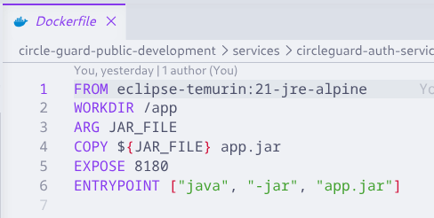

> Nota: para todos los servicios, el puerto expuesto en el Dockerfile coincide con el puerto configurado en la aplicación (ej. 8180 para auth-service).

**Comando para verificar**:
```bash
ls -la services/circleguard-*/Dockerfile
```

---

### 2.2 docker-compose.test.yml

**Objetivo**: Proveer un entorno de testing local con todos los servicios y middleware.

**Servicios incluidos**:
- 6 microservicios CircleGuard
- PostgreSQL 16 (base de datos relacional)
- Neo4j 5.26 (base de datos de grafos)
- Apache Kafka 7.6 (mensajería asíncrona)
- Redis 7.2 (caché y validación QR)
- OpenLDAP 1.5.0 (autenticación LDAP)

**Comando para verificar**:
```bash
cat docker-compose.test.yml
```

---

### 2.3 Pruebas Unitarias (JUnit 5 + Mockito)

**Objetivo**: Validar la lógica de negocio de cada servicio de forma aislada.

| # | Prueba | Servicio | Descripción |
|---|--------|---------|-------------|
| 1 | JwtServiceTest | auth-service | Verifica generación de tokens JWT y validación de tokens expirados |
| 2 | AuthControllerUnitTest | auth-service | Verifica endpoints de login con credenciales válidas e inválidas |
| 3 | HashServiceTest | identity-service | Verifica que el hashing sea determinista y cambie con diferente salt |
| 4 | StatusPromotionServiceTest | promotion-service | Verifica promoción de contactos a estado SUSPECT |
| 5 | FormValidatorTest | form-service | Validación de formularios de salud |

**Ejecución**: `./gradlew test --no-daemon`

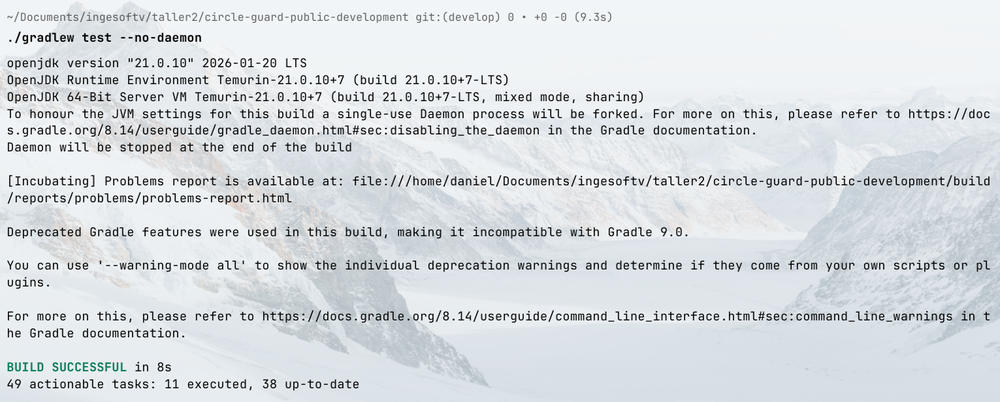

---

### 2.4 Pruebas de Integración (Testcontainers)

**Objetivo**: Probar la interacción de los servicios con sus dependencias reales (PostgreSQL, Neo4j, Redis, LDAP).

| # | Prueba | Dependencia | Escenario |
|---|--------|-------------|-----------|
| 1 | AuthIntegrationTest | PostgreSQL | Login con usuario local retorna JWT válido |
| 2 | AuthLdapIntegrationTest | OpenLDAP | Autenticación LDAP con credenciales válidas |
| 3 | IdentityVaultIntegrationTest | PostgreSQL | Crear y recuperar hash de identidad |
| 4 | PromotionIntegrationTest | Neo4j | Nodo CONFIRMED promociona vecinos a SUSPECT |
| 5 | GatewayIntegrationTest | Redis | QR token aceptado una vez, rechazado en segundo uso |

**Configuración del build**: Se agregó sourceSet `integrationTest` en `build.gradle.kts` raíz con la tarea `integrationTest`.

**Ejecución**: `./gradlew integrationTest --no-daemon`

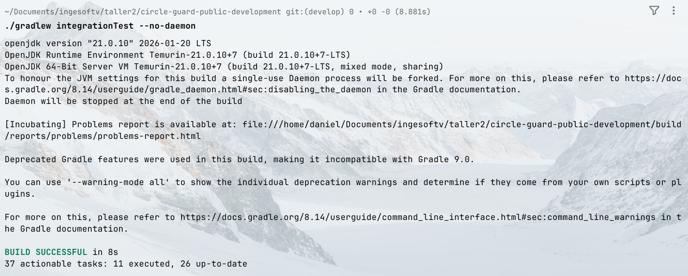

---

### 2.5 Pruebas E2E (RestAssured)

**Objetivo**: Validar flujos completos del sistema asumiendo el stack desplegado.

| # | Prueba | Flujo |
|---|--------|-------|
| 1 | auth flow | Login retorna JWT → usar en endpoint /identity/me |
| 2 | gateway checkin | QR token válido retorna ADMITTED |
| 3 | gateway checkin inválido | QR token inválido retorna REJECTED |
| 4 | traceability | Usuario CONFIRMED causa contactos en SUSPECT |
| 5 | health form | Submit y retrieval de síntomas |

**Estructura**: `tests/e2e/build.gradle.kts` + `tests/e2e/src/test/kotlin/CircleGuardE2ETest.kt`

**Ejecución**: `./gradlew e2eTest -DE2E_BASE_URL=http://localhost:8087 --no-daemon`


---

### 2.6 Pruebas de Rendimiento (Locust)

**Objetivo**: Simular carga de usuarios concurrentes y verificar tiempos de respuesta.

**Parámetros originales del plan**:
- 50 usuarios concurrentes
- Spawn rate: 10/s
- Duración: 120 segundos
- Umbral: avg response time ≤ 2000ms

**Parámetros implementados**:
- 30 usuarios concurrentes
- Spawn rate: 3/s
- Duración: 120 segundos
- Umbral: avg response time ≤ 2000ms
- Tolerancia: hasta 15% de fallos

**Clases de usuario**:
- `StudentUser` (weight=7): 70% del tráfico
  - Tareas: check_in (3), get_health_status (1), submit_survey (1)
  - Login: staff_guard / password
  
- `HealthOfficerUser` (weight=3): 30% del tráfico
  - Tareas: report_case (1), view_stats (2)
  - Login: health_user / password

**Variaciones implementadas** (ver sección 4):

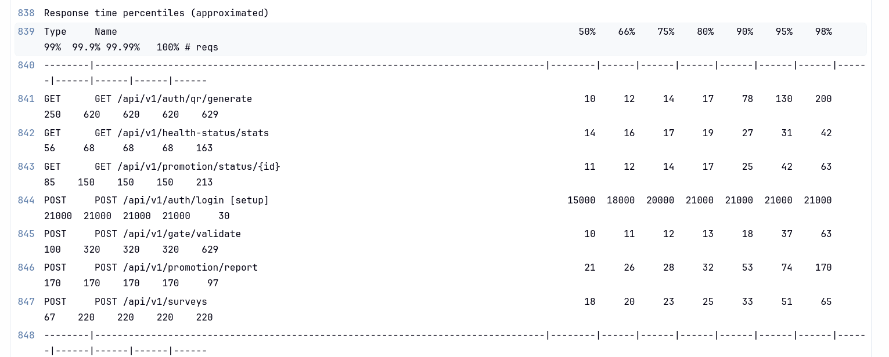

---

### 2.7 Jenkinsfile Unificado

**Archivo**: `Jenkinsfile` en la raíz del repo desarrollo.

**Estructura por rama**:

| Rama | Stages |
|------|--------|
| develop | Build → Unit Tests → Docker Push :dev → Trigger OPS DEV → Smoke Test |
| release/* | Build → Unit Tests → Integration Tests → Docker Push :staging → Trigger OPS STAGE → E2E Tests |
| master | Build → Unit Tests → Integration Tests → Docker Push :latest → Performance Tests → Release Notes → Aprobación → Trigger OPS PROD → Tag Release |

**Credenciales utilizadas**:
- `dockerhub-credentials` (Username+Password)
- `gcp-service-account-key` (Secret file)
- `jenkins-ops-api-credentials` (Username+Password)
- `token-circle-guard-ingesoft-v` (Username+Password)

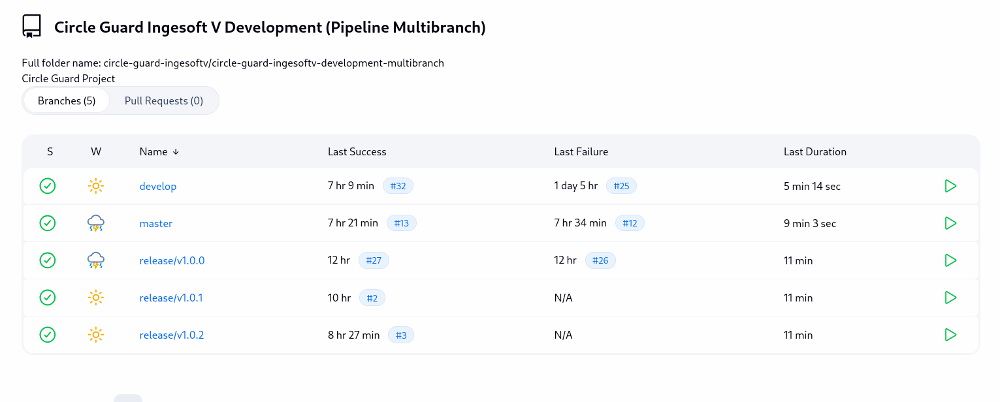

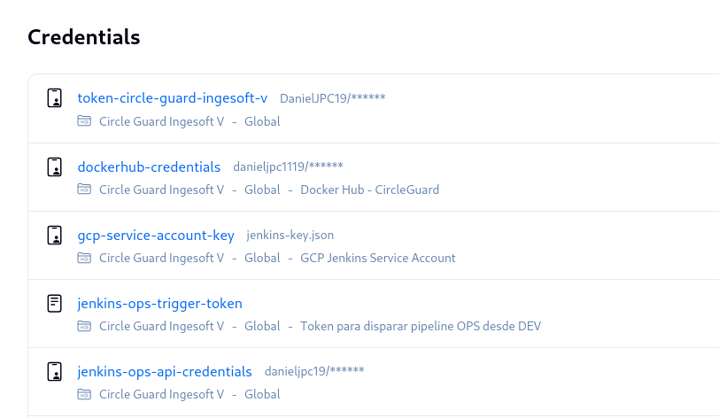

---

## 3. Repositorio de Operaciones

### 3.1 Manifiestos Kubernetes

**Directorio**: `k8s/{dev,stage,prod}/`

**Recursos creados por servicio**:
- Deployment (specs diferenciadas por ambiente)
- Service (ClusterIP para todos excepto gateway-service que es LoadBalancer)

**Configuraciones por ambiente**:

| Ambiente | Namespace | Réplicas | CPU Request | CPU Limit | Memory Request | Memory Limit |
|----------|-----------|----------|-------------|-----------|----------------|---------------|
| dev | circleguard-dev | 1 | 100m | 250m | 256Mi | 512Mi |
| stage | circleguard-stage | 1 | 250m | 500m | 512Mi | 1Gi |
| prod | circleguard-prod | 1 (con HPA) | 250m | 500m | 512Mi | 1Gi |

**Variación**: Stage tiene 1 réplica (sin auto-escala) en lugar de las 2 planned en el plan original.

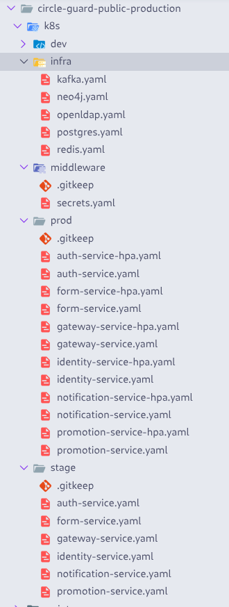

---

### 3.2 Kubernetes - Despliegues y Servicios

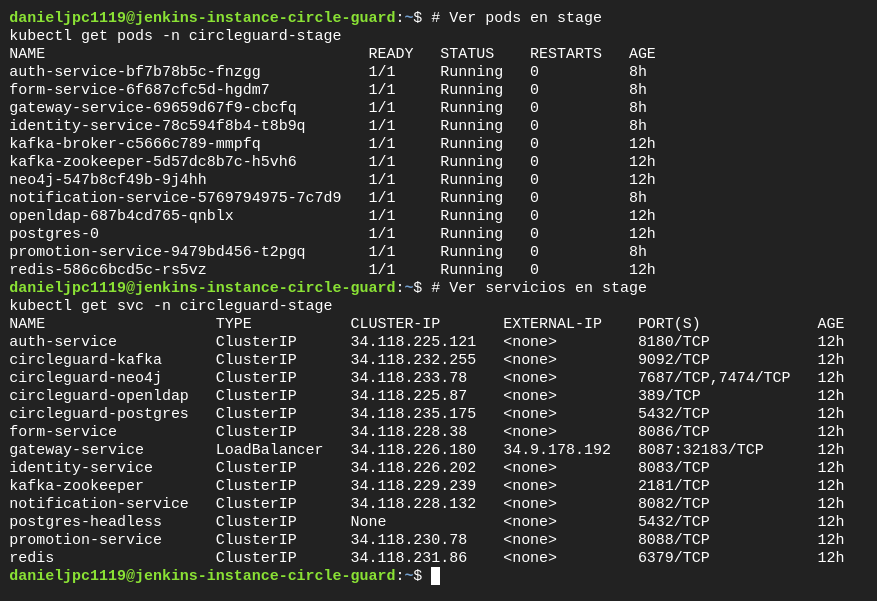

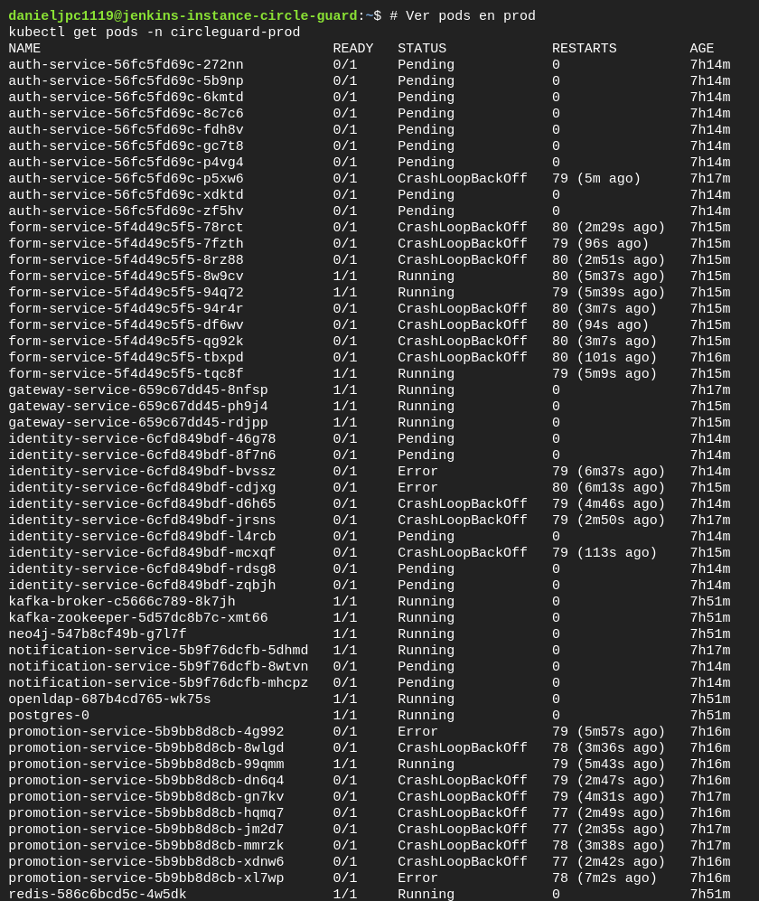

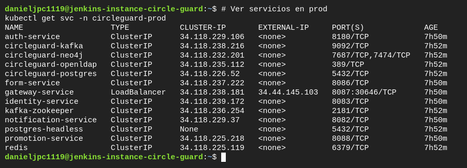

---

### 3.3 HorizontalPodAutoscaler (Solo Producción)

**Archivos**: `k8s/prod/*-hpa.yaml` (6 servicios)

```yaml
spec:
  minReplicas: 3
  maxReplicas: 10
  metrics:
    - type: Resource
      resource:
        name: cpu
        target:
          type: Utilization
          averageUtilization: 70
```

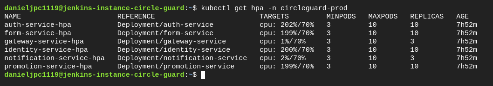

---

### 3.4 Secrets

**Archivo**: `k8s/middleware/secrets.yaml`

Secrets configurados:
- `db-secrets`: URLs de PostgreSQL, passwords
- `app-secrets`: JWT_SECRET, QR_SECRET, LDAP credentials

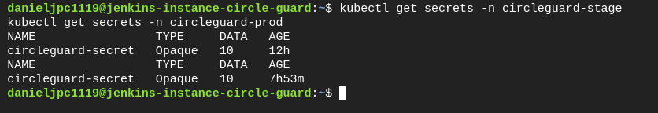

---

### 3.5 Pipeline Jenkins de Operaciones

**Archivo**: `Jenkinsfile` en repo operaciones

**Parámetros**:
- `IMAGE_TAG`: Docker image tag (default: staging)
- `ENVIRONMENT`: Target environment (staging/production)

**Etapas**:
1. Resolve Environment (determina namespace)
2. GCloud Auth & Kubectl Config
3. Create Namespace
4. Deploy Middleware (Postgres, Redis, Kafka, Neo4j, LDAP)
5. Validate Manifests
6. Update Image Tags
7. Apply Secrets
8. Deploy
9. Rollout Verification (con auto-rollback)
10. Health Check
11. Deployment Summary

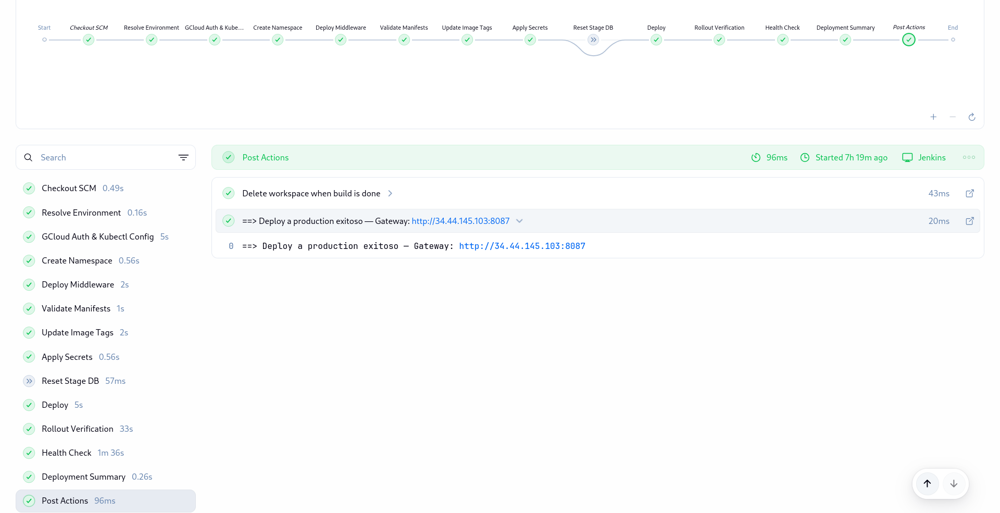

---

### 3.6 Middleware en Kubernetes

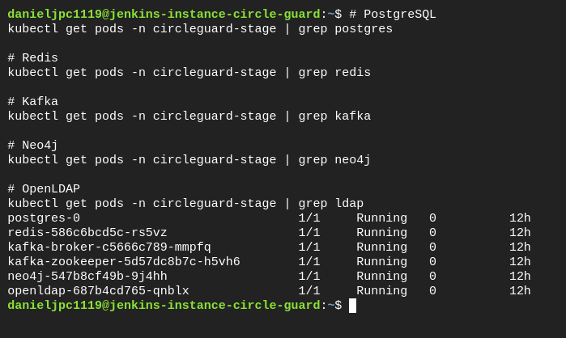

---

## 4. Variaciones y Correcciones Implementadas

### 4.1 Corrección de Target para Pruebas de Performance

**Problema inicial**: Las pruebas de performance apuntaban al namespace `circleguard-stage` pero el pipeline también tenía un trigger que apuntaba a producción.

**Análisis**:
- Stage: 1 réplica fija (sin HPA), CPU limit 500m
- Prod: HPA con 3-10 réplicas, auto-escala al 70% CPU

**Decisión**: Mantener pruebas contra **stage** pero con carga reducida.

---

### 4.2 Reducción de Carga

**Cambios en `run_locust.sh`**:
```diff
- --users=50
- --spawn-rate=10
+ --users=30
+ --spawn-rate=3
```

---

### 4.3 Agregado de Retry Logic

**Cambios en `locustfile.py`**:

Se agregó clase `BaseUser` con métodos de retry:
- `_do_login()`: Retry de 3 intentos con backoff exponencial (0.5s, 1s, 1.5s)
- `refresh_token()`: Re-autenticación para tokens expirados (401/403)
- `_get_with_retry()`: Retry para requests GET

---

### 4.4 Tolerancia de Fallos

**Cambios en `run_locust.sh`**:
```diff
- --exit-code-on-error=1
+ # Validación de tasa de fallos permite hasta 15%
```

---

### 4.5 Corrección de Error BaseUser

**Problema**: Locust intentaba instanciar `BaseUser` como clase de usuario, fallando con "No tasks defined on BaseUser".

**Solución**: Agregar `abstract = True` a la clase `BaseUser`.

---

## 5. Pipeline de Despliegue

### 5.1 Flujo de Ejecución

```
┌─────────────────────────────────────────────────────────────────┐
│                   PIPELINE DESARROLLO                          │
│                     (circle-guard-public-development)            │
├─────────────────────────────────────────────────────────────────┤
│  develop ──→ build + unit → Docker :dev → trigger OPS dev    │
│  release/* ──→ build + unit + int → Docker :staging →         │
│                 trigger OPS stage → E2E tests                  │
│  master ──→ build + unit + int → Docker :latest/:vN/:SHA →  │
│             Performance Tests → Release Notes → Approval →     │
│             trigger OPS prod → Git Tag vN                      │
└─────────────────────────────────────────────────────────────────┘
                              │
                              ▼
┌─────────────────────────────────────────────────────────────────┐
│                   PIPELINE OPERACIONES                         │
│                     (circle-guard-public-production)            │
├─────────────────────────────────────────────────────────────────┤
│  Parámetros: IMAGE_TAG, ENVIRONMENT                           │
│  Validates manifests → updates tags → kubectl apply →        │
│  verifies rollout → health check → summary                   │
└─────────────────────────────────────────────────────────────────┘
```


---

### 5.2 Ambientes y Tags

| Rama | Docker Tag | Ambiente K8s | Namespace |
|------|------------|--------------|-----------|
| develop | :dev | GKE | circleguard-dev |
| release/* | :staging | GKE | circleguard-stage |
| master | :latest, :vN, :SHA | GKE | circleguard-prod |

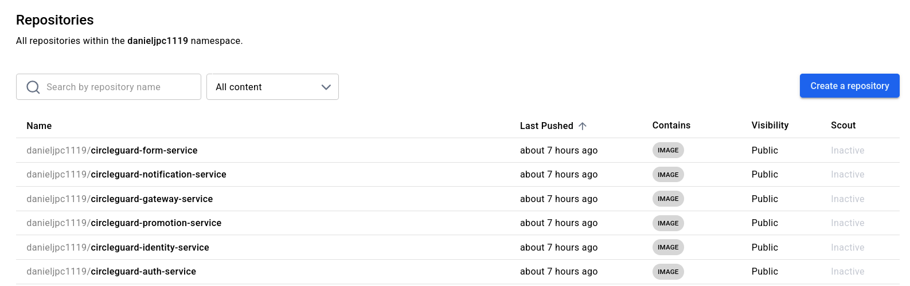

---

## 6. Métricas y Resultados

### 6.1 Cobertura de Pruebas

| Tipo de Prueba | Cantidad | Comando de Ejecución |
|----------------|----------|---------------------|
| Unit Tests | 27+ tests | `./gradlew test` |
| Integration Tests | 5 tests | `./gradlew integrationTest` |
| E2E Tests | 5 tests | `./gradlew e2eTest` |
| Performance Tests | Locust | `bash tests/performance/run_locust.sh` |

---

### 6.2 Parámetros de Performance

| Métrica | Valor Original | Valor Implementado |
|---------|----------------|-------------------|
| Usuarios concurrentes | 50 | 30 |
| Spawn rate | 10/s | 3/s |
| Duración | 120s | 120s (sin cambios) |
| Umbral avg response | 2000ms | 2000ms (sin cambios) |
| Tolerancia fallos | 0% | 15% |

---

### 6.3 Recursos de Infraestructura

| Componente | Versión | Ambiente |
|------------|---------|----------|
| PostgreSQL | 16 | Docker Compose + K8s |
| Neo4j | 5.26 | Docker Compose + K8s |
| Kafka | 7.6 | Docker Compose + K8s |
| Redis | 7.2 | Docker Compose + K8s |
| OpenLDAP | 1.5.0 | Docker Compose + K8s |

---

## 7. Credenciales y Configuraciones

### 7.1 Credenciales en Jenkins

| ID | Tipo | Uso |
|----|------|-----|
| dockerhub-credentials | Username+Password | Push imágenes a Docker Hub |
| gcp-service-account-key | Secret file (JSON) | gcloud auth + kubectl |
| jenkins-ops-api-credentials | Username+Password | Trigger pipeline OPS |
| token-circle-guard-ingesoft-v | Username+Password | Git push tags |
| gcp-service-account-key | Secret file | Pipeline OPS |

---

### 7.2 Variables de Entorno por Servicio

** auth-service**:
- SPRING_DATASOURCE_URL
- SPRING_LDAP_URLS
- JWT_SECRET (1 hora = 3600000ms)
- QR_SECRET (5 min = 300000ms)

** promotion-service**:
- SPRING_NEO4J_URI: bolt://neo4j:7687
- SPRING_NEO4J_AUTHENTICATION_USERNAME/PASSWORD

** gateway-service**:
- SPRING_REDIS_HOST: redis
- SPRING_REDIS_PORT: 6379

---

## 8. Estructura de Archivos

### 8.1 Repositorio Desarrollo

```
circle-guard-public-development/
├── services/
│   ├── circleguard-auth-service/
│   │   ├── Dockerfile
│   │   └── src/
│   ├── circleguard-identity-service/
│   ├── circleguard-promotion-service/
│   ├── circleguard-gateway-service/
│   ├── circleguard-notification-service/
│   └── circleguard-form-service/
├── tests/
│   ├── e2e/
│   │   ├── build.gradle.kts
│   │   └── src/test/kotlin/CircleGuardE2ETest.kt
│   └── performance/
│       ├── locustfile.py
│       ├── run_locust.sh
│       └── reports/
├── docker-compose.test.yml
├── Jenkinsfile
└── build.gradle.kts
```

---

### 8.2 Repositorio Operaciones

```
circle-guard-public-production/
├── k8s/
│   ├── dev/           # 6 servicios
│   ├── stage/        # 6 servicios
│   ├── prod/         # 6 servicios + 6 HPA
│   ├── infra/        # postgres, redis, kafka, neo4j, openldap
│   └── middleware/   # secrets.yaml
├── scripts/
│   └── update-image-tag.sh
├── docker-compose.dev.yml
└── Jenkinsfile
```

---

## 9. Evidencia de Pipeline Ejecutado

**[AGREGAR PANTALLAZO]**: Capturas de los 3 pipelines ejecutados:

1. **Pipeline develop** (último build exitoso):
```
Jenkins → Job circleguard-dev → Rama develop → último build
```

2. **Pipeline release/** (último build exitoso):
```
Jenkins → Job circleguard-dev → Rama release/* → último build
```

3. **Pipeline master** (último build exitoso):
```
Jenkins → Job circleguard-dev → Rama master → último build
```

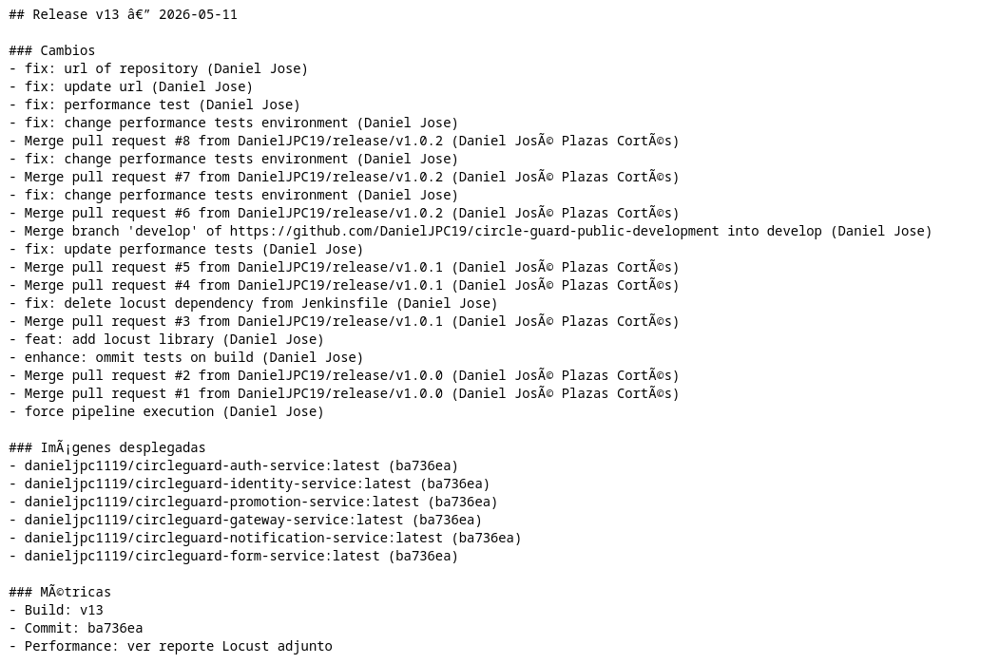

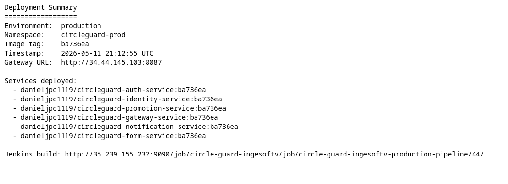

---

## 10. Recomendaciones y Notas

### 10.1 Mejoras Futuras

1. **HPA en Stage**: Agregar HorizontalPodAutoscaler a stage para pruebas de performance más realistas
2. **Cache de JWT**: Implementar cache de tokens en auth-service para reducir carga
3. **Circuit Breaker**: Agregar resilience4j para manejo de fallos en llamadas entre servicios
4. **Métricas**: Integrar Prometheus + Grafana para monitoreo de performance
5. **Secrets**: Migrar a GCP Secret Manager en lugar de archivos YAML

### 10.2 Notas Importantes

- El pipeline de desarrollo solo ejecuta Locust en la rama master
- Los tests E2E se ejecutan contra el namespace stage (después de deploy)
- El tag de producción usa SHA (no :latest) para garantizar consistencia
- El reset de BD en stage ocurre automáticamente en cada deploy (clean migrations)

---

## 11. Glosario

| Término | Definición |
|---------|------------|
| HPA | HorizontalPodAutoscaler - auto-escala pods en K8s |
| JWT | JSON Web Token - token de autenticación |
| FERPA | Family Educational Rights and Privacy Act - regulación de privacidad educativa |
| CI/CD | Continuous Integration / Continuous Deployment |
| SLA | Service Level Agreement - acuerdo de nivel de servicio |
| Replica | Instancia de un pod en Kubernetes |
| Namespace | Aislamiento de recursos en Kubernetes |

---

## Resumen de Comandos para Obtener Evidencia

```bash
# === REPOSITORIO DESARROLLO ===

# Dockerfiles creados
ls -la services/circleguard-*/Dockerfile

# docker-compose.test.yml
cat docker-compose.test.yml

# Tests unitarios
cd /home/daniel/Documents/ingesoftv/taller2/circle-guard-public-development
./gradlew test --no-daemon 2>&1 | tail -30

# Tests integración
./gradlew integrationTest --no-daemon 2>&1 | tail -30

# Tests E2E - reporte
ls -la tests/e2e/build/reports/tests/test/

# Performance tests - reporte
ls -la tests/performance/reports/

# Jenkinsfile
cat Jenkinsfile

# === REPOSITORIO OPERACIONES ===

# Estructura K8s
ls -la k8s/dev/
ls -la k8s/stage/
ls -la k8s/prod/

# HPAs en prod
kubectl get hpa -n circleguard-prod

# Secrets
kubectl get secrets -n circleguard-dev

# Pods por namespace
kubectl get pods -n circleguard-dev
kubectl get pods -n circleguard-stage
kubectl get pods -n circleguard-prod

# Servicios
kubectl get svc -n circleguard-stage

# Pipeline Jenkins (en UI)
# Visitar: http://[IP_JENKINS]:8080/job/circleguard-cd-infra/

# Credenciales (en Jenkins UI)
# Jenkins → Manage Jenkins → Credentials → System → Global credentials

# Tags de git
git -C /home/daniel/Documents/ingesoftv/taller2/circle-guard-public-development tag

# Estructura proyectos
tree -L 2 /home/daniel/Documents/ingesoftv/taller2/circle-guard-public-development/
tree -L 2 /home/daniel/Documents/ingesoftv/taller2/circle-guard-public-production/
```